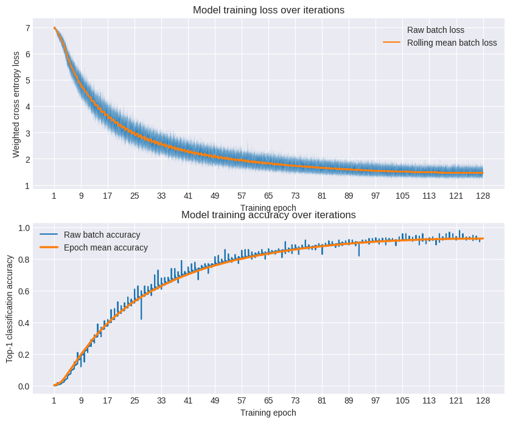
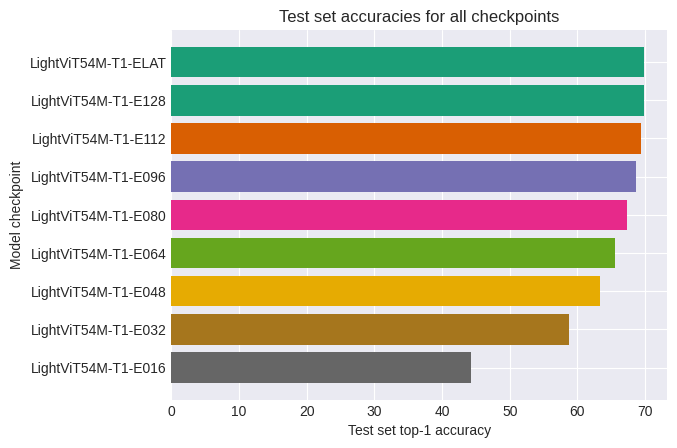

# From-scratch ViT

This is my implementation of a lightweight visual transformer (ViT) for educational purposes. The goal of the project was to implement and train a ViT end-to-end fully by hand from scratch locally.

*This project is still a work in progress*

The first version of my model:
- 16 encoder layers
- 512 embedding dimension
- 256x256 target resolution
- 16x16 grid of patches
- Classification token for final outputs

The model has 54 million parameters. The training results are as follows:

The model was trained on:
- NVIDIA GeForce RTX 4060 Ti (my home setup)
- 115.52 hours of wall-clock training time
- 128 epochs
- 10% warmup, cosine annealing scheduler

Checkpoints were saved at every 16th epoch, not including the first epoch, and an additional latest (LAT) checkpoint for debug purposes. Here is the test set performance on all checkpoints.

The final model came out heavily overfitted. Having achieved 92%+ accuracy on the training set, it can barely achieve 70% on the test set. Consider that the dataset used for this project was a small 500k image sample from ImageNet, where 80% of it was used for training and 20% for testing. My initial training session did not include: stochastic depth, CutMix/MixUp augmentations, heavy regularization, and live evaluation. Which I plan to implement in my next run.
